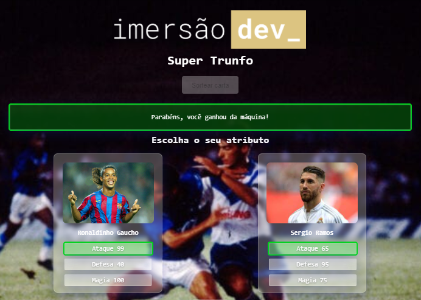
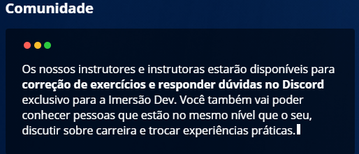
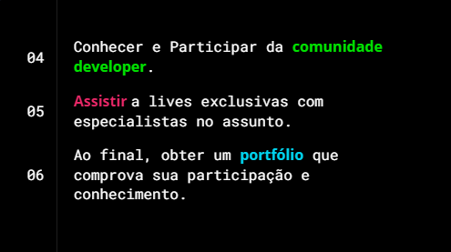

<h3 align="center">
  🎮 Super Trunfo - Jogadores 🎮
</h3>

<blockquote align="center">“Duelo de cartas aleatórias de jogadores, quem tiver mais overall ganha, o objetivo é ganhar da maquina”</blockquote>

## ⚽ Cartas

- A carta curinga(mais forte do jogo) "Ronaldo Fenomeno" 
  ataque: 100 / magia: 97
  <h1 align="center">
  
</h1>

- No jogo tem cartas de jogadores da atualidade e jogadores aposentados, ídolos em clubes que ja passaram. 

## :rocket: Tecnologias:

Esse projeto foi desenvolvido com as seguintes tecnologias:

- [HTML][html]
- [CSS][css]
- [Java][js]

## 🎫 O que é a Imersão DEV?

Um evento com 10 aulas gratuitas e desafios práticos para dar os primeiros passos na área de programação e criar seus primeiros códigos,
 Você vai aprender com quem domina o assunto e terá todo apoio da nossa equipe e comunidade durante o projeto.
 

* Aulas todos os dias.

* desafios, porque o melhor aprendizado é na prática.

* Especialistas em programação e com a qualidade da maior escola de tecnologia online do Brasil.

* São 10 aulas gratuitas para aprender a criar seus primeiros códigos e começar sua carreira em programação.

## 🎫 O que você vai aprender??

## 🔗 Criado em CodePen 

Projeto feito na semana Imersão DEV da Alura. 🏆 [Saiba mais!](https://imersao.dev/)
 
------
Copyright (c) 2021 by Amadeu Filipe Lopes (https://codepen.io/felipelopes12/pen/YzNpLvq)

[html]: https://developer.mozilla.org/pt-BR/docs/Web/HTML
[css]: https://developer.mozilla.org/pt-BR/docs/Web/CSS
[js]: https://developer.mozilla.org/pt-BR/docs/Web/JavaScript

